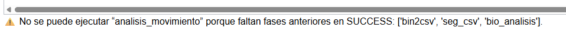

# Manual de Uso de la Aplicación

## Inicio de la aplicación

Para abrir la aplicación, se recomienda crear un acceso directo o abrir el archivo .bat en la carpeta orginal de la aplicación. Es posible que tarde unos segundos en iniciarse la primera vez; si se produce un error, basta con volver a lanzarla. Tras esta primera ejecución, la aplicación funciona correctamente de forma continuada.

Al ejecutarla, se abrirá una terminal de comandos, la cual debe permanecer abierta (aunque puede minimizarse). Esta terminal permite visualizar mensajes y detalles del proceso, aunque su uso no es necesario para operar la aplicación.

*Figura 1. Terminal de comandos tras lanzar la aplicación.*

---

## Acceso a la interfaz web

Tras unos segundos, se abrirá automáticamente la aplicación en el navegador, mostrando la pestaña de inicio. Si aún no se ha creado ningún paciente, esta página aparecerá vacía, como se aprecia en la Figura 2.

*Figura 2. Página inicial de la aplicación.*

La interfaz dispone de dos pestañas principales:

- ***Trabajos***: muestra los procesos de pacientes activos o creados en el día actual.
- ***Histórico***: recoge los procesos finalizados correctamente en fechas anteriores.

*Figura 3. Página de pacientes con procesos completados previo al día actual.*

Ambas páginas incluyen un campo de búsqueda para filtrar pacientes y un botón de **Actualizar** para refrescar manualmente los datos.

*Figura 4. Filtrado de datos de pacientes.*

---

## Creación de un nuevo proceso

### Acceso al formulario

Desde la página principal, al pulsar **Nuevo Proceso**, se accede al formulario para registrar los datos del paciente. Si se navega a otra pestaña, se sale del formulario.

*Figura 5. Formulario del paciente.*

Por el contrario, si se desea rellenar el formulario se dispone de distintos campos a rellenar. Además, hay dos botones Aceptar en verde y Cancelar en rojo. El primero servirá para terminar el formulario correctamente y comenzar el proceso mientras que cancelar volverá a la página de Trabajos sin crear ningún proceso.

---

### Campos obligatorios

Los campos marcados con un asterisco (\*) en el formulario son obligatorios. Si no se rellenan no se permitirá continuar con el proceso del paciente.

*Figura 6. Error al no completar los campos obligatorios.*

Estos campos obligatorios son:

- *Tipo de paciente:* Permite seleccionar entre un *Nuevo Paciente* si no dispone de ningún proceso creado para este, o por el contrario se puede elegir *Paciente Existente* y crear un nuevo proceso para alguno que ya disponga de algún proceso creado en un día previo, creando así uno nuevo para la fecha actual.

- *Identificador del paciente:* se da un valor por defecto inicialmente (P001, P002...) o se abre una lista desplegable en el caso de que se haya elegido un *Paciente Existente*.

- *Ruta del archivo:* Al pulsar sobre el campo se abre un desplegable con los archivos que hay guardados en la carpeta \_bucket, y que dispondrá de los datos del reloj.

- *Fecha de nacimiento:* En este campo se introduce la fecha de nacimiento del paciente. Se puede realizar de dos maneras, escribiendo la fecha (automáticamente se añaden las '/' conforme se escribe la fecha), o pulsando a la flecha azul que aparece a la derecha del campo. Esto despliega una caja (Fecha) que al pulsarla abre un calendario interactivo en el que se puede buscar la fecha deseada. ***Nota:*** en el caso de usar el calendario interactivo, se aconseja seleccionar en el calendario el día y mes adecuado y posteriormente escribir manualmente el año correcto (p.ej. 21/03/2025 -> 21/03/1992), para un uso más rápido.

- *Sexo:* Sexo del paciente (desplegable con opciones).

- *N.º de días de entrenamiento de fuerza.*

### Campos opcionales

Otros campos opcionales son los siguientes:

- *Nombre:* Nombre del paciente.

- *Nombre del médico.*

- *N.º de días de entrenamiento de equilibrio:* Este campo solo estará accesible a su escritura si el paciente tiene más de 65 años (>=65), si la fecha de nacimiento es superior a ese valor, el campo se podrá editar, en caso contrario estará bloqueado.

- *Comentarios.*

- *Acciones (Mover/Copiar):* Acciones realizables con el archivo del reloj (Mover a la carpeta del paciente / Copiar a la carpeta del paciente).

### Confirmación del formulario

Si se ha rellenado el formulario correctamente, al pulsar Aceptar se lanzará el proceso principal para el paciente y se regresará a la página inicial (Trabajos).

*Figura 7. Paciente creado y proceso lanzado (Página de Trabajos).*

A medida que se completan los subprocesos, el sistema muestra el estado **SUCCESS** en cada uno de ellos. Mientras el proceso está en curso, su estado aparece como **RUNNING**. La página se actualiza automáticamente cada 15 segundos, aunque es posible forzar la actualización manualmente mediante el botón **Actualizar**.

La tabla de procesos permite el desplazamiento tanto vertical como horizontal. En la parte inferior de la página aparece un mensaje de estado, que indicará si se están realizando procesos o si no hay ninguna acción activa.

*Figura 8. Mensaje de procesos visible en la página de Trabajos.*

---

## Acciones sobre procesos en ejecución

En la columna **Acciones**, ubicada a la derecha de la tabla de la pestaña **Trabajos**, se encuentran tres funcionalidades disponibles para los procesos en ejecución.

*Figura 9. Acciones realizables sobre el proceso.*

Al lanzar un proceso principal tras rellenar el formulario el proceso se ejecuta de forma directa hasta que complete todo el proceso. Sin embargo, se puede realizar distintas operaciones que afectan al curso del proceso:

### Detener proceso

El botón **Detener** permite interrumpir un proceso en curso. Al hacerlo, el estado del proceso cambiará de **RUNNING** a **CANCELLED** y aparecerá un mensaje indicando que el proceso ha sido detenido.

*Figura 10. Detalles al parar un proceso.*

### Continuar proceso

Si un proceso ha quedado detenido (estado **CANCELLED**) o la aplicación se cerró mientras estaba en estado **RUNNING** sin completarse, puede retomarse pulsando el botón **Continuar**. Esta acción reiniciará la ejecución del paso en que se detuvo, y el estado volverá a ser **RUNNING**.

*Figura 11. Detalles al reiniciar un proceso (Continuar).*

### Seleccionar proceso específico

En lugar de continuar desde el punto anterior, el usuario puede elegir ejecutar directamente un subproceso específico. Para ello, debe seleccionar la opción deseada desde una lista desplegable.

*Figura 12. Lista desplegable de procesos seleccionables.*

Si se selecciona cualquiera de las opciones de la lista de procesos aparecerá el mismo mensaje que al **Continuar** señalando que los procesos para el paciente se han iniciado inmediatamente.

***Nota***: Si ya hay un proceso activo, no se permitirá lanzar uno nuevo ni continuar uno previo.

*Figura 13. Posibles fallos - No permite lanzar proceso si hay uno activo.*

***Nota***: Si, se selecciona un subproceso que depende de pasos anteriores no completados (no en estado **SUCCESS**), tampoco será posible ejecutarlo.

*Figura 14. Posibles fallos -- No permite lanzar un proceso si hay pasos previos sin completar.*

Los únicos subprocesos que pueden lanzarse de forma independiente entre sí son **Análisis de bioseñales** y **Análisis de movimiento**, siempre y cuando el resto de los procesos previos estén finalizados.

---

## Procesos en cola (*ESPERA*)
En el caso de haber creado un proceso para un paciente y que este se encuentre en ejecución, su proceso será el principal. No obstante, es posible seguir creando nuevos procesos para otros pacientes, siguiendo el procedimiento previamente mencionado. Tras ello, el segundo paciente se quedará en estado **PENDING** hasta que el proceso del otro paciente que estaba **RUNNING** pase a **CANCELLED** en el caso de querer pararlo, o termine el proceso de forma completa para este primer paciente.

*Figura 15. Procesos encolados -- Espera a que el proceso previo haya finalizado.*

Se pueden crear todos los pacientes que se desee y estos estarán en este estado de espera mientras haya uno previo creado y en funcionamiento. En el caso de continuar un proceso que se encontraba parado **CANCELLED** y haya otro en funcionamiento, el protocolo será el mismo, entrará en espera hasta que el anterior quede finalizado o parado.

---

## Generación del informe del paciente

Una vez completados todos los subprocesos, el sistema habilita el enlace **Generate Report**, que permite generar un informe personalizado con los datos del paciente. Este enlace aparece en color azul tanto en la pestaña **Trabajos** como en **Histórico**, dependiendo de si el proceso se completó el mismo día o en días anteriores.

*Figura 16. Proceso completado en el día actual.*

### Visualización del informe

Al generar el informe (una vez pulsado el enlace *Generate Report*), este se guarda automáticamente en formato PDF dentro de la carpeta **05_rep** correspondiente al paciente. Además, el usuario puede acceder posteriormente al informe generado mediante el enlace **View Report**, que sustituye a **Generate Report** una vez el documento ha sido creado.

*Figura 17. Ver Informe generado previamente.*

### Descarga manual del informe

Desde la página del informe, es posible descargar manualmente el archivo en PDF pulsando el botón **Descargar Informe (PDF)**. Este procedimiento guarda una copia en la misma carpeta del paciente y, adicionalmente, en la carpeta de **Descargas** del ordenador, facilitando su localización.

***Nota**: El proceso de generación y descarga del informe puede tardar entre 8 y 12 segundos, ya que durante ese tiempo el sistema convierte el contenido a formato PDF.*

Otra opción rápida de descarga del informe e impresión, se encuentra al pulsar el botón **Imprimir Informe (PDF)**. Este botón se encuentra junto al de descarga en la parte superior de la ventana del informe.
Una vez seleccionada esta última opción se abre la pestaña del navegador que facilita el proceso de impresión, selección de impresora o descarga del PDF.

*Figura 18. Pestaña de impresión del PDF.*

---

## Eliminación de pacientes

En la pestaña **Histórico**, si un paciente ya no es relevante o se desea eliminar su información del sistema, puede hacerse mediante el botón **Eliminar**. Esta acción elimina al paciente tanto de la aplicación como de los directorios de trabajo asociados.

*Figura 19. Acción "Eliminar" (Página de Histórico).*

## Uso de la terminal de comandos (opcional)

Mientras la aplicación está abierta, la terminal de comandos puede permanecer minimizada. No obstante, si se desea consultar información detallada sobre el proceso, como mensajes del sistema o registros internos, estos pueden visualizarse directamente en dicha terminal.

*Figura 20. Ejemplos de mensajes mostrados en la terminal de comandos.*